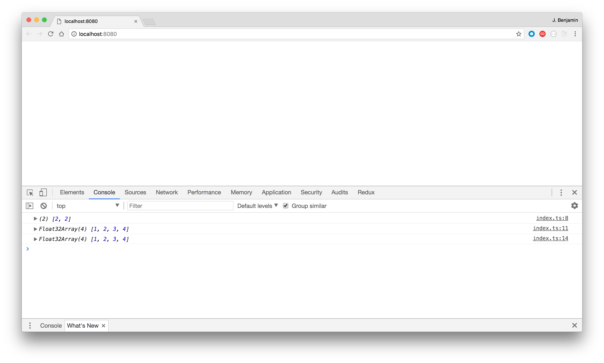

# deeplearnjs quick start

1. Install dependencies with `yarn install` (Note: you'll need to install [npm](https://www.npmjs.com/get-npm) and [yarn](https://yarnpkg.com/lang/en/docs/install/))
2. Start the development server with `yarn start`. This should open a browser with a blank screen.
3. Open the console to see the results that have been printed (screen shot below).
4. Start coding. `./src/index.ts` is the entry point.

# A few other notes

deeplearnjs is written in TypeScript, which is what we use here.
It's a typed version of JavaScript and the basics can be learned pretty quickly through [this tutorial](https://www.typescriptlang.org/docs/handbook/typescript-in-5-minutes.html).

Every time you save a code change, you will be able to see it by reloading the browser page (this might happen automatically).

The html page that's being loaded is `./public/index.html`. You can add other html and JavaScript to this page. Just refresh the browser to see the changes. This is useful for downloading images that can be fed to a deeplearnjs model.
Take a look at [these models](https://github.com/PAIR-code/deeplearnjs/tree/master/models) for examples of how the
TypeScript/html/other JavaScript interact.

